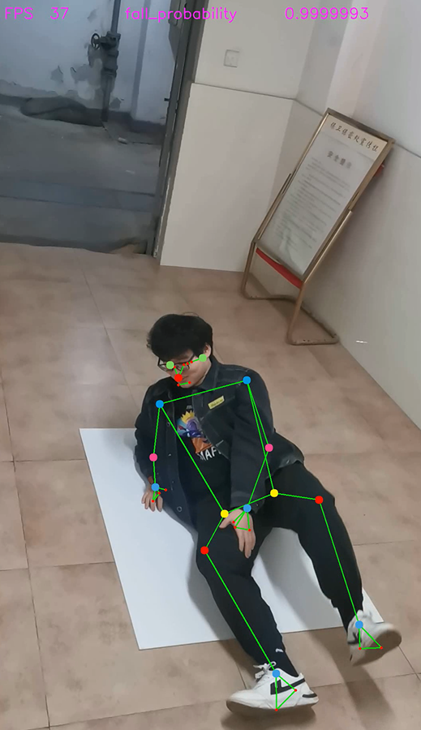

#　[A simple falling detection system based on mediapipe](https://github.com/shwj114514/FallingDetectionByMediapipe.git)
## demo

## pipeline
Extract the key points of human body by [mediapipe](https://google.github.io/mediapipe/) ,then cluster these key point by MLP and output the softmax result, which is "falling" or "up"


## refer
https://www.bilibili.com/video/BV1dL4y1h7Q6

```
git init
git add *
git commit -m "first commit"
git remote add origin https://github.com/shwj114514/FallingDetectionByMediapipe.git
git push -u origin master
```

切换账号
```
git config --global user.name "shwj114514"
git config --global user.email "3278668047@qq.com"
```